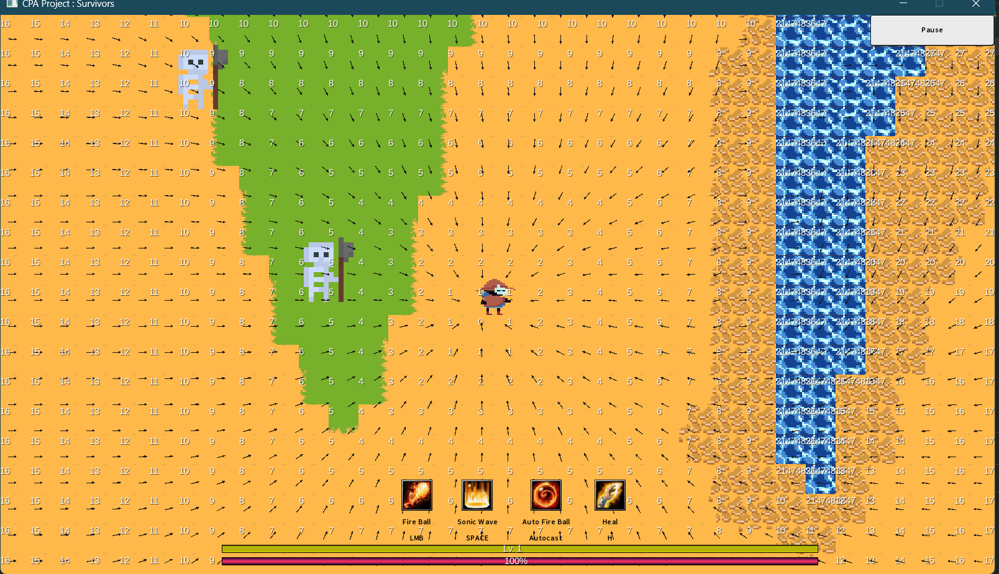

# YASG: Yet Another Survivors Game

## Overview

Welcome to **YASG (Yet Another Survivors Game)**, a 2D game developed in Java using the libGDX framework. This game draws inspiration from popular survivors games, featuring procedural generation for dynamic terrain creation and efficient memory usage for smooth gameplay. The game implements two procedural generation methods: Wave Function Collapse and noise-based generation, along with pathfinding using Dijkstra's flowfield algorithm.

## Features

- **Minimal LibGDX usage**: we used LibGDX for simple sprite handling and box collision .
- **Procedural Generation**: 
  - **Wave Function Collapse**: Creates intricate and varied environments.
  - **Noise-Based Generation**: Uses Perlin noise for natural-looking terrains.
- **Pathfinding**: 
  - **Dijkstra Flowfield**: Ensures intelligent and efficient navigation for game entities.
- **Efficient Memory Usage**: Optimized to run smoothly on a variety of hardware.

## Installation

To run the game locally, follow these steps:

1. **Clone the repository**:
   ```bash
   git clone https://github.com/yourusername/YASG.git
   cd YASG

2. **Build the project using Gradle**:
   ```bash
   git clone https://github.com/yourusername/YASG.git
   cd YASG

## Gameplay
In YASG, players navigate a procedurally generated world, surviving against waves of enemies. Using different attacks, offering new challenges and experiences.


## Procedural Generation Techniques

### -> Wave Function Collapse
Wave Function Collapse (WFC) is a constraint-solving algorithm that generates levels by combining tiles that adhere to a set of rules, resulting in complex and aesthetically pleasing patterns.

- Link to Wave Function Collapse official github repo: [here](https://github.com/mxgmn/WaveFunctionCollapse).

### -> Noise-Based Generation
Noise-based procedural generation uses algorithms like Perlin noise to create realistic terrains and environments.

- Link to article explaining Perlin Noise Procedural Generation : [here](https://rtouti.github.io/graphics/perlin-noise-algorithm).

## Pathfinding: Dijkstra Flowfield
Dijkstra's flowfield algorithm provides a robust solution for pathfinding, allowing game entities to navigate complex environments efficiently, we chose this solution because of the nature of our game where the enemies all navigate towards the player.

Flow Feild on debug Mode : 


- Link to article explaining Dijkstra’s Algorithm : [here](https://www.researchgate.net/figure/Navigation-flow-field-produced-by-Dijkstras-algorithm-stored-in-the-Navigation-layer_fig2_221254772)
- Link to article explaining Flow Field Pathfinding : [here](https://leifnode.com/2013/12/flow-field-pathfinding/)

## Memory Efficiency
The game is designed to use memory efficiently, ensuring smooth performance even on less powerful hardware. Techniques such as object pooling and efficient data structures are employed to optimize memory usage.

## Contibuters:
- Rachid Bouhmad 
- Do Truong Thinh TRUONG
